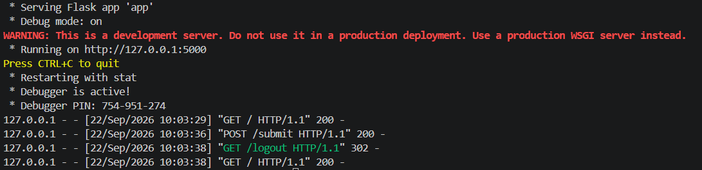

# mEthics - Learning Flask Project

This is a web application built with [Flask](https://flask.palletsprojects.com/) to demonstrate basic concepts like routing, template rendering, handling form submissions, session management, and connecting to a MySQL database.

<p align="center">
  
</p>

## Project Structure

- **`app.py`**: The main entry point for the Flask application. It contains the server configuration, database connection, routing logic, and handles user authentication against the MySQL database.
- **`templates/`**: Directory containing HTML templates rendered using Jinja2.
  - **`index.html`**: The main beautiful landing page for the application.
  - **`user.html`**: The Learning Hub dashboard with various subject links.
  - **`login.html`**: The login page with a form that takes a username and password.
  - **`admin.html`**: The dashboard shown to authenticated users.
- **`.env`**: Stores environment variables such as the secret key and MySQL database credentials.
- **`flask.txt`**: Contains quick learning notes on Flask routing, HTTP methods (GET/POST), and templating.
- **`rivision.py`**: *(Excluded from analysis)* Script containing additional revision or experimental code.

## Features

1. **MySQL Database Integration**:
   - Connects to a local MySQL database to manage and retrieve user information.
2. **User Authentication**:
   - Validates user credentials by querying a `users` table in the MySQL database instead of hardcoded values.
3. **Session Management**:
   - Utilizes Flask sessions to keep users logged in and securely log them out.
4. **Environment Variables**:
   - Reads secure configuration settings from a `.env` file using the `python-dotenv` package for both Flask keys and Database credentials.

## Prerequisites

Make sure you have Python and a local MySQL server installed. You'll also need to install the project dependencies:

```bash
pip install Flask python-dotenv mysql-connector-python
```

## How to Run

1. Clone or download the repository.
2. Ensure you have a local MySQL server running. Create a database and a `users` table with `username` and `password` columns. Insert at least one user record for testing.
3. Ensure the `.env` file is present in the root directory and contains the following variables:
   - `secret_code`: Your Flask secret key for sessions.
   - `name`: The name of your MySQL database.
   - `password`: The password for your local MySQL `root` user.
4. Run the application from your terminal:

```bash
python app.py
```

5. The server will start in debug mode. Open your web browser and go to:
   `http://127.0.0.1:5000/`

## Routes Info

- **`GET /`**: Renders the beautiful landing page (`index.html`).
- **`GET /login`**: Renders the login page (`login.html`).
- **`POST /submit`**: Processes the login form submission. It connects to the MySQL database and verifies if the credentials exist in the `users` table. If correct, it sets a session variable and renders the admin page (`admin.html`). If incorrect, it displays an error message.
- **`GET /logout`**: Clears the user's session data and redirects back to the landing page.

## Activated server will look like this :-

<p align="center">
  
</p>
<br>

## Note -
### --> **Frontend and UI design of website is designed by AI** because this project focuses on backend, so backend is completely written by Author (Mohit singh)